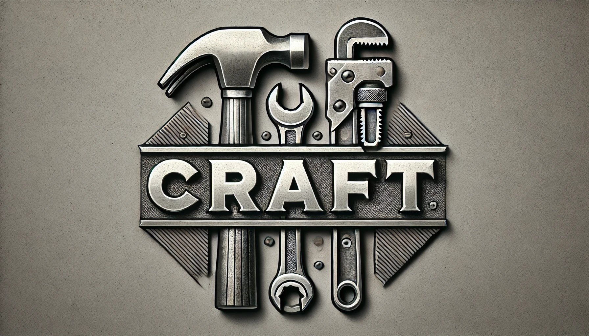
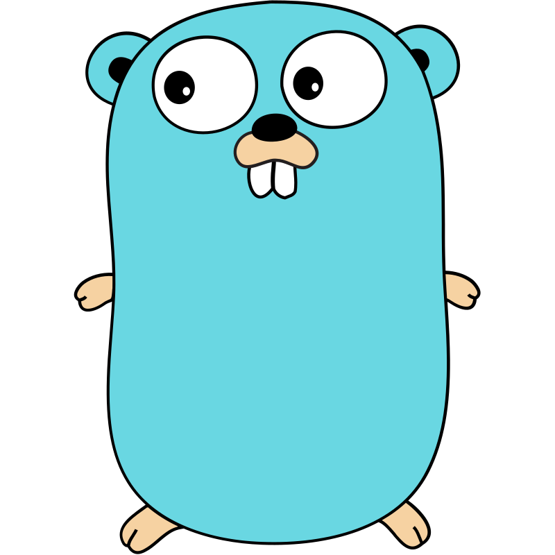

# **Craft CLI Tool**




## **Overview**
The `Craft` CLI is a tool designed to simplify the process of bootstrapping new projects by generating boilerplate code for various languages and frameworks.

- 🛠️ **Simplifies Project Bootstrapping**: Generates boilerplate code for various languages and frameworks.  
- 🐳 **Docker-Ready**: All projects are designed to run in Docker containers, allowing you to create and use them without installing the required language.
- 🌐 **Multi-Language Support**: Works with Go, Java, and other supported languages.  
- 🏎️ **Small and Fast**: A lightweight CLI tool designed for quick execution.  
- 💡 **Efficient and Reliable**: Helps you start and maintain projects effortlessly.  

## **Table of Contents**

- [Problems with Other Scaffolding Tools](#problems-with-other-scaffolding-tools)
- [Why Use Craft](#why-use-craft)
- [Features](#features)
- [Installation](#installation)
- [Command Line Usage](#command-line-usage)
  - [Creating New Projects](#1-creating-new-projects)
  - [Updating Existing Projects](#2-updating-existing-projects)
  - [Inspecting Supported Operations](#3-inspecting-supported-operations)
- [Supported Languages](#supported-languages)
- [License](#license)

---
## ⚠️ Problems with Other Scaffolding Tools

While exploring new languages or starting small projects, I encountered several issues with existing scaffolding tools:

1. **Target Language Dependencies**: Most tools require you to have the target language installed to use them, making setup cumbersome.  
2. **Language-Specific Tools**: Existing tools are often tied to a single language, limiting flexibility for multi-language workflows.  
3. **Complex Projects**: These tools often generate large, interconnected setups that can be overwhelming for beginners or unnecessary for small tasks.  
4. **No Dockerized Setup**: Few tools create a containerized environment, making it harder to run the created projects in isolated and consistent environments.

These problems slow down productivity, create barriers for quickly experimenting with a new language or solving coding challenges, and result in projects that do not run in a containerized, isolated setup. Running projects in Docker containers ensures consistency by providing a uniform environment across systems, eliminating 'it works on my machine' issues, isolating dependencies, and enabling easy cleanup or switching between projects without affecting the host system.

---

## 🛠️ Why Use Craft?

- **Dockerized Development**: Automatically creates a containerized environment for every project, so you don’t need the language or runtime installed on your machine.
- **Lightweight and Fast**: Runs as a precompiled binary, ensuring fast execution without additional dependencies required on your host.
- **Multi-Language Support**: Works seamlessly across multiple languages, making it versatile for various tasks.
- **Minimal Setup**: Generates only the essential files needed to start coding, with the option to create more complex setups if you’re familiar with the language. This allows you to build and structure your project the way you want.
- **Beginner-Friendly**: Focuses on simplicity and clarity, giving you exactly what you need to get started with a new language or task.

## ✨ Features

- **Project Scaffolding** (`new` command):
  - Quickly generate project files and structure for supported languages and frameworks.
  - Embedded templates ensure a consistent starting point for new projects.

- **Project Updates** (`update` command):
  - Modify and maintain existing projects with additional boilerplate code or configuration updates.

- **Inspection** (`inspect` command):
  - View all allowed operations and their supported language/framework combinations.

- **Flexible Project Naming**:
  - Use the current directory name as the project name.
  - Specify a custom project name with a command-line flag.

- **Docker-Ready**:
  - Generated and updated projects are pre-configured to run in Docker containers.

---

## 📥 Installation

1. Clone the repository:
   ```bash
   git clone https://github.com/VincentVanCode101/craft.git
   cd craft
   ```

2. Build the binary:
   ```bash
   ./getBinary.sh
   ```
  - the binary is automatically added to `/usr/local/bin/craft`
---

## 💻 Command Line Usage

### 1. Creating New Projects

Generate a new project by specifying the language:
```bash
craft new <language>
```

#### Options:
- `--name, -n`: Specify a name for the new project.
- `--current-dir-name, -c`: Use the current directory name for the project.

#### Examples:
1. Generate a Go project in the current directory:
   ```bash
   craft new go -c
   ```

2. Generate a new Java project with Maven in a directory named `MyJavaApp`:
   ```bash
   craft new java-maven-noframework -n MyJavaApp
   ```

3. View help for the `new` command:
   ```bash
   craft new --help
   ```

### 2. Updating Existing Projects

Modify an existing project to include additional boilerplate or updated configuration:
```bash
craft update <language>
```

#### Examples:
1. Update a Java project with a specific framework:
   ```bash
   craft update java-maven-quarkus
   ```

2. Update a Go project:
   ```bash
   craft update go
   ```

3. View help for the `update` command:
   ```bash
   craft update --help
   ```

---

### 3. Inspecting Supported Operations

View all allowed operations and their supported languages/framework combinations:
```bash
craft inspect
```

#### **Example**:
```bash
craft inspect
```
Example output:
```
Allowed Operations:
- new: go, java-maven-noframework
- update: go
```

---

# 🌐Supported Languages

<span style="display: flex; align-items: center; gap: 10px; font-size: 2rem; font-weight: bold; line-height: 1;">
  Go 
</span>

<details>
<summary>more</summary>

- **Allowed Operations**:
  - `new`: Create a new Go project ([Documentation](./docs/go.md)).
  - `update`: Update an existing Go project ([Documentation](./docs/go.md)).
  
#### **Examples**:
1. Create a new Go project:
   ```bash
   craft new go -c
   ```

2. Update an existing Go project:
   ```bash
   craft update go
   ```

[Learn more about crafting new Go projects](./docs/go.md).

</details>

<h2 style="display: flex; align-items: center; gap: 10px; font-size: 2rem; font-weight: bold; line-height: 1;">
  Java 
</h2>

<details>
<summary>more</summary>

- **Allowed Build Tools and Frameworks**:
  - **Maven**:
    - `noframework`: Create a Java projects without any specific framework. ([Documentation](./docs/java-maven-noframework.md))
    - `spring`: Coming soon...
    - `quarkus`: Coming soon...
  - **Gradle**:
    - `noframework`: Coming soon...
    - `spring`: Coming soon...
    - `quarkus`: Coming soon...

#### **Examples**:
1. Create a new Java project using Maven:
   ```bash
   craft new java-maven-noframework -c
   ```

2. Update an existing Java project:
   ```bash
   craft update java-maven-noframework
   ```

[Learn more about crafting new Java projects](./docs/java-maven-noframework.md).

</details>

---

## **📜License**

Licensed under [MIT License](./LICENSE)
